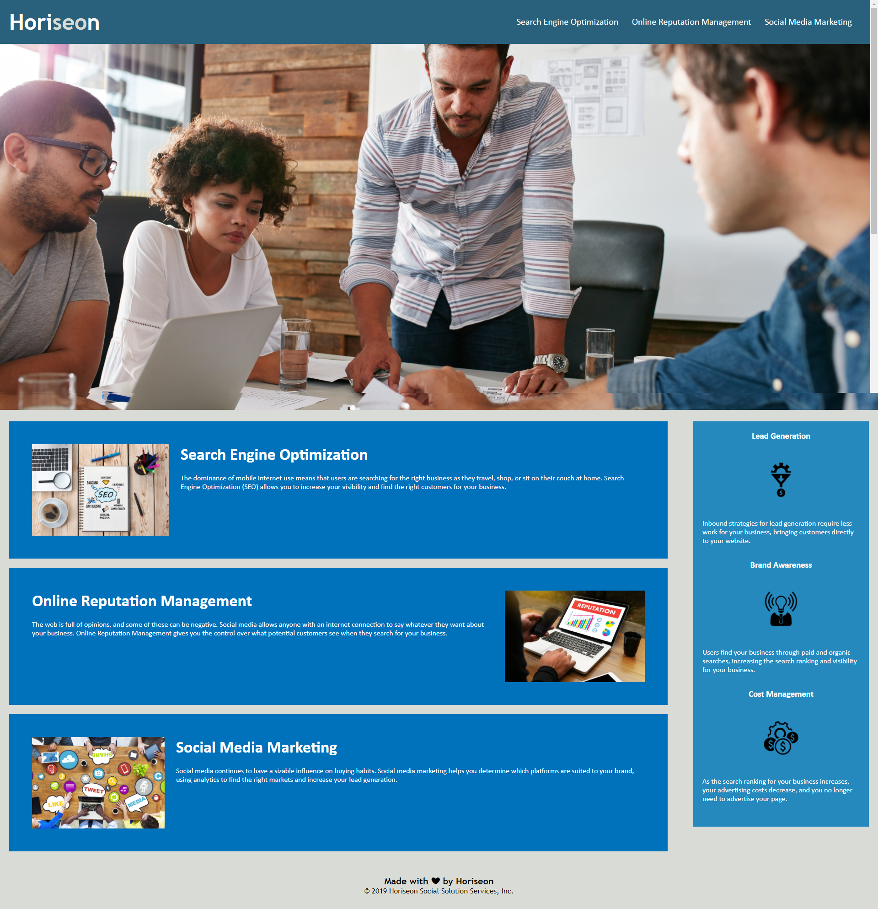

# **Horiseon Code Refactor**

## **Goal**
---
 
The code was built in a non-accessable way, and the main goal was to access the code and make it more accessable.  Accessable websites get better access to search engines and it makes the website more accessible to more potential customers. To do this HTML tags were replaced with more approiate semantic tags and alt tags were created for all images.

While the code was being modified the code was being cleaned up.  The redudant class tags were consolidated and more approriate tags were assigned for all class tags involved.  

[The deployed website](https://jerler1.github.io/horiseon_refactoring_enhancement/) has a more robust accessbility suite now, and is more likely to be accessed via search engines due to the accessibility improvements.

[Github Repository Link](https://github.com/jerler1/horiseon_refactoring_enhancement)

### **Installation**
---
 
The steps to complete the refactoring of this website:
 

1. Enhanced the div tags to approriate semantic tags.
1. Added alt tags and descriptions to all images.
1. Changed the title to be more focused the brand.
1. Merged the CSS to make future changes more dynamic and accessable.

### **Usuage**
---
 
This is a mostly informational webpage.  There are some links at the top right that will transport you to the approatiate location.

### **License**
  
Copyright (c) 2005-2020 David Heinemeier Hansson

Permission is hereby granted, free of charge, to any person obtaining
a copy of this software and associated documentation files (the
"Software"), to deal in the Software without restriction, including
without limitation the rights to use, copy, modify, merge, publish,
distribute, sublicense, and/or sell copies of the Software, and to
permit persons to whom the Software is furnished to do so, subject to
the following conditions:

The above copyright notice and this permission notice shall be
included in all copies or substantial portions of the Software.

THE SOFTWARE IS PROVIDED "AS IS", WITHOUT WARRANTY OF ANY KIND,
EXPRESS OR IMPLIED, INCLUDING BUT NOT LIMITED TO THE WARRANTIES OF
MERCHANTABILITY, FITNESS FOR A PARTICULAR PURPOSE AND
NONINFRINGEMENT. IN NO EVENT SHALL THE AUTHORS OR COPYRIGHT HOLDERS BE
LIABLE FOR ANY CLAIM, DAMAGES OR OTHER LIABILITY, WHETHER IN AN ACTION
OF CONTRACT, TORT OR OTHERWISE, ARISING FROM, OUT OF OR IN CONNECTION
WITH THE SOFTWARE OR THE USE OR OTHER DEALINGS IN THE SOFTWARE.
